# World Model: Causal Loop Diagram

Jay W. Forrester's World2 model (*World Dynamics*, Figure 2-1), redrawn in Mermaid.

The diagram was generated from `source-code.dyn`, not traced from the figure. Every arrow comes from an equation: if a variable appears on the right side of an equation, it has an arrow into the variable on the left. Node IDs are the exact DYNAMO names, so they match `source-code.dyn` and `definition-of-terms.md`. Unlike Forrester's figure, each information link carries a polarity sign (+ or -), so feedback loops can be traced and classified. The legend follows the diagram.

```mermaid
%%{init: {"themeCSS": ".edgeLabel, .edgeLabel p, .edgeLabel span { font-size: 22px; font-weight: bold; }"}}%%
flowchart TB
  classDef level fill:#cfe2ff,stroke:#084298,stroke-width:2px,color:#000
  classDef rate fill:#fff3cd,stroke:#997404,stroke-width:2px,color:#000
  classDef aux fill:#e2e3e5,stroke:#41464b,color:#000
  classDef supp fill:#d1e7dd,stroke:#0f5132,color:#000
  classDef const fill:#ffffff,stroke:#6c757d,stroke-dasharray:3 3,color:#000
  classDef cloud fill:#f8f9fa,stroke:#adb5bd,stroke-dasharray:2 2,color:#6c757d

  subgraph POPULATION["Population sector"]
    P["P<br/>Population<br/>eq 1"]:::level
    BR{{"BR<br/>Birth rate<br/>eq 2"}}:::rate
    DR{{"DR<br/>Death rate<br/>eq 10"}}:::rate
    SRC_BR(["source"]):::cloud
    SNK_DR(["sink"]):::cloud
    BRN[/"BRN<br/>Birth rate normal<br/>= 0.04, switch to BRN1 at SWT1"/]:::const
    DRN[/"DRN<br/>Death rate normal<br/>= 0.028, switch to DRN1 at SWT3"/]:::const
    BRMM(("BRMM<br/>Birth-rate-from-material multiplier<br/>table BRMMT<br/>eq 3")):::aux
    BRCM(("BRCM<br/>Birth-rate-from-crowding multiplier<br/>table BRCMT<br/>eq 16")):::aux
    BRFM(("BRFM<br/>Birth-rate-from-food multiplier<br/>table BRFMT<br/>eq 17")):::aux
    BRPM(("BRPM<br/>Birth-rate-from-pollution multiplier<br/>table BRPMT<br/>eq 18")):::aux
    DRMM(("DRMM<br/>Death-rate-from-material multiplier<br/>table DRMMT<br/>eq 11")):::aux
    DRCM(("DRCM<br/>Death-rate-from-crowding multiplier<br/>table DRCMT<br/>eq 14")):::aux
    DRFM(("DRFM<br/>Death-rate-from-food multiplier<br/>table DRFMT<br/>eq 13")):::aux
    DRPM(("DRPM<br/>Death-rate-from-pollution multiplier<br/>table DRPMT<br/>eq 12")):::aux
    CR(("CR<br/>Crowding ratio<br/>eq 15")):::aux
    LA[/"LA<br/>Land area<br/>= 135E6"/]:::const
    PDN[/"PDN<br/>Population density normal<br/>= 26.5"/]:::const
  end

  subgraph RESOURCES["Natural-resource sector"]
    NR["NR<br/>Natural resources<br/>eq 8"]:::level
    NRUR{{"NRUR<br/>Natural-resource-usage rate<br/>eq 9"}}:::rate
    SNK_NRUR(["sink"]):::cloud
    NRUN[/"NRUN<br/>Natural-resource usage normal<br/>= 1, switch to NRUN1 at SWT2"/]:::const
    NRMM(("NRMM<br/>Natural-resource-from-material multiplier<br/>table NRMMT<br/>eq 42")):::aux
    NRFR(("NRFR<br/>Natural-resource fraction remaining<br/>eq 7")):::aux
    NRI[/"NRI<br/>Natural resources initial<br/>= 900E9"/]:::const
    NREM(("NREM<br/>Natural-resource-extraction multiplier<br/>table NREMT<br/>eq 6")):::aux
  end

  subgraph CAPITAL["Capital sector"]
    CI["CI<br/>Capital investment<br/>eq 24"]:::level
    CIG{{"CIG<br/>Capital-investment generation<br/>eq 25"}}:::rate
    CID{{"CID<br/>Capital-investment discard<br/>eq 27"}}:::rate
    SRC_CIG(["source"]):::cloud
    SNK_CID(["sink"]):::cloud
    CIGN[/"CIGN<br/>Capital-investment generation normal<br/>= 0.05, switch to CIGN1 at SWT4"/]:::const
    CIDN[/"CIDN<br/>Capital-investment discard normal<br/>= 0.025, switch to CIDN1 at SWT5"/]:::const
    CIM(("CIM<br/>Capital-investment multiplier<br/>table CIMT<br/>eq 26")):::aux
    CIR(("CIR<br/>Capital-investment ratio<br/>eq 23")):::aux
    ECIR(("ECIR<br/>Effective-capital-investment ratio<br/>eq 5")):::aux
    ECIRN[/"ECIRN<br/>Effective-capital-investment ratio normal<br/>= 1"/]:::const
    MSL(("MSL<br/>Material standard of living<br/>eq 4")):::aux
  end

  subgraph AGRICULTURE["Agriculture sector"]
    CIAF["CIAF<br/>Capital-investment-in-agriculture fraction<br/>eq 35"]:::level
    CIAFT[/"CIAFT<br/>Capital-investment-in-agriculture-fraction adjustment time<br/>= 15 years"/]:::const
    CIAFN[/"CIAFN<br/>Capital-investment-in-agriculture fraction normal<br/>= 0.3"/]:::const
    CFIFR(("CFIFR<br/>Capital fraction indicated by food ratio<br/>table CFIFRT<br/>eq 36")):::aux
    CIQR(("CIQR<br/>Capital-investment-from-quality ratio<br/>table CIQRT<br/>eq 43")):::aux
    CIRA(("CIRA<br/>Capital-investment ratio in agriculture<br/>eq 22")):::aux
    FPCI(("FPCI<br/>Food potential from capital investment<br/>table FPCIT<br/>eq 21")):::aux
    FCM(("FCM<br/>Food-from-crowding multiplier<br/>table FCMT<br/>eq 20")):::aux
    FPM(("FPM<br/>Food-from-pollution multiplier<br/>table FPMT<br/>eq 28")):::aux
    FR(("FR<br/>Food ratio<br/>eq 19")):::aux
    FC[/"FC<br/>Food coefficient<br/>= 1, switch to FC1 at SWT7"/]:::const
    FN[/"FN<br/>Food normal<br/>= 1"/]:::const
  end

  subgraph POLLUTION["Pollution sector"]
    POL["POL<br/>Pollution<br/>eq 30"]:::level
    POLG{{"POLG<br/>Pollution generation<br/>eq 31"}}:::rate
    POLA{{"POLA<br/>Pollution absorption<br/>eq 33"}}:::rate
    SRC_POLG(["source"]):::cloud
    SNK_POLA(["sink"]):::cloud
    POLN[/"POLN<br/>Pollution normal<br/>= 1, switch to POLN1 at SWT6"/]:::const
    POLCM(("POLCM<br/>Pollution-from-capital multiplier<br/>table POLCMT<br/>eq 32")):::aux
    POLR(("POLR<br/>Pollution ratio<br/>eq 29")):::aux
    POLS[/"POLS<br/>Pollution standard<br/>= 3.6E9"/]:::const
    POLAT(("POLAT<br/>Pollution-absorption time<br/>table POLATT<br/>eq 34")):::aux
  end

  subgraph QUALITY["Quality-of-life sector"]
    QL((("QL<br/>Quality of life<br/>eq 37"))):::supp
    QLS[/"QLS<br/>Quality-of-life standard<br/>= 1"/]:::const
    QLM(("QLM<br/>Quality of life from material<br/>table QLMT<br/>eq 38")):::aux
    QLC(("QLC<br/>Quality of life from crowding<br/>table QLCT<br/>eq 39")):::aux
    QLF(("QLF<br/>Quality of life from food<br/>table QLFT<br/>eq 40")):::aux
    QLP(("QLP<br/>Quality of life from pollution<br/>table QLPT<br/>eq 41")):::aux
  end

  %% ===== Material flows (thick arrows): source -> rate -> level, or level -> rate -> sink =====
  SRC_BR ==> BR ==>|"+ inflow"| P
  P ==>|"- outflow"| DR ==> SNK_DR
  NR ==>|"- outflow"| NRUR ==> SNK_NRUR
  SRC_CIG ==> CIG ==>|"+ inflow"| CI
  CI ==>|"- outflow"| CID ==> SNK_CID
  SRC_POLG ==> POLG ==>|"+ inflow"| POL
  POL ==>|"- outflow"| POLA ==> SNK_POLA

  %% ===== Information links (dashed arrows), labeled with polarity =====
  P -.->|"+"| BR
  BRN -.->|"+"| BR
  BRMM -.->|"+"| BR
  BRCM -.->|"+"| BR
  BRFM -.->|"+"| BR
  BRPM -.->|"+"| BR
  P -.->|"+"| DR
  DRN -.->|"+"| DR
  DRMM -.->|"+"| DR
  DRCM -.->|"+"| DR
  DRFM -.->|"+"| DR
  DRPM -.->|"+"| DR
  MSL -.->|"-"| BRMM
  CR -.->|"-"| BRCM
  FR -.->|"+"| BRFM
  POLR -.->|"-"| BRPM
  MSL -.->|"-"| DRMM
  CR -.->|"+"| DRCM
  FR -.->|"-"| DRFM
  POLR -.->|"+"| DRPM
  P -.->|"+"| CR
  LA -.->|"-"| CR
  PDN -.->|"-"| CR
  P -.->|"+"| NRUR
  NRUN -.->|"+"| NRUR
  NRMM -.->|"+"| NRUR
  MSL -.->|"+"| NRMM
  NR -.->|"+"| NRFR
  NRI -.->|"-"| NRFR
  NRFR -.->|"+"| NREM
  P -.->|"+"| CIG
  CIGN -.->|"+"| CIG
  CIM -.->|"+"| CIG
  CI -.->|"+"| CID
  CIDN -.->|"+"| CID
  MSL -.->|"+"| CIM
  P -.->|"-"| CIR
  CI -.->|"+"| CIR
  NREM -.->|"+"| ECIR
  CIR -.->|"+"| ECIR
  CIAF -.->|"-"| ECIR
  CIAFN -.->|"+"| ECIR
  ECIR -.->|"+"| MSL
  ECIRN -.->|"-"| MSL
  CIAFT -.->|"time"| CIAF
  CFIFR -.->|"+"| CIAF
  CIQR -.->|"+"| CIAF
  FR -.->|"-"| CFIFR
  QLM -.->|"+"| CIQR
  QLF -.->|"-"| CIQR
  CIR -.->|"+"| CIRA
  CIAF -.->|"+"| CIRA
  CIAFN -.->|"-"| CIRA
  CIRA -.->|"+"| FPCI
  CR -.->|"-"| FCM
  POLR -.->|"-"| FPM
  FPCI -.->|"+"| FR
  FCM -.->|"+"| FR
  FPM -.->|"+"| FR
  FC -.->|"+"| FR
  FN -.->|"-"| FR
  P -.->|"+"| POLG
  POLN -.->|"+"| POLG
  POLCM -.->|"+"| POLG
  POL -.->|"+"| POLA
  POLAT -.->|"-"| POLA
  CIR -.->|"+"| POLCM
  POL -.->|"+"| POLR
  POLS -.->|"-"| POLR
  POLR -.->|"+"| POLAT
  QLS -.->|"+"| QL
  QLM -.->|"+"| QL
  QLC -.->|"+"| QL
  QLF -.->|"+"| QL
  QLP -.->|"+"| QL
  MSL -.->|"+"| QLM
  CR -.->|"-"| QLC
  FR -.->|"+"| QLF
  POLR -.->|"-"| QLP
```

## Legend

### Node shapes

| Shape | Mermaid syntax | Meaning | DYNAMO card |
|---|---|---|---|
| Rectangle (blue) | `P["..."]` | **Level** (stock). Accumulates its inflows minus its outflows. | L |
| Hexagon (yellow) | `BR{{"..."}}` | **Rate** (the valve on a flow pipe). Units per year. | R |
| Circle (grey) | `CR(("..."))` | **Auxiliary**. A label line `table XXXT` means the value comes from a table lookup (a "multiplier"). | A |
| Double circle (green) | `QL((("...")))` | **Supplementary**. Computed for output only; nothing else in the model uses it. | S |
| Parallelogram (white, dashed border) | `LA[/"..."/]` | **Constant**, with its value. | C |
| Rounded pill labeled source or sink | `SRC_BR(["source"])` | **Cloud**. A flow coming from, or going to, outside the model. | none |

Each node label gives the DYNAMO name, a short description, the lookup table if any, and the equation number in `source-code.dyn`.

### Arrows

| Arrow | Mermaid syntax | Meaning |
|---|---|---|
| Thick solid | `==>` | **Material flow**. Physical stuff moving through a rate into or out of a level. |
| Thin dotted | `-.->` | **Information link**. The source variable appears in the target's equation. |

Some Mermaid renderers draw a few of the dotted arrows as solid lines. Thickness still tells them apart: all 14 thick arrows are material flows, and all 79 thin arrows are information links.

### Polarity signs

| Label | Meaning |
|---|---|
| `+` | If the source goes up, the target goes up (all else equal). |
| `-` | If the source goes up, the target goes down (all else equal). |
| `time` | CIAFT is an adjustment time. It sets how fast CIAF moves, not which direction. |
| `+ inflow` | On a thick arrow: the rate adds to the level. |
| `- outflow` | On a thick arrow: the rate drains the level. |

How the signs were derived:

- **Products and ratios.** A variable in a numerator gets `+`; a variable in a denominator gets `-`. Example: CR = P / (LA * PDN), so P -> CR is `+`, and LA -> CR and PDN -> CR are `-`.
- **Table lookups.** Every table in the model only rises or only falls across its range (some go flat at one end), so each table-driven link has a single sign everywhere. Example: BRMMT falls from 1.2 to 0.7 as MSL rises, so MSL -> BRMM is `-`.

### Tracing feedback loops

A loop is **reinforcing** if it contains an even number of `-` links (zero counts as even), and **balancing** if it contains an odd number.

One catch is outflows. The thick arrow for an outflow points from the level to the rate (P ==> DR), because that is where the material goes. Causally, though, the rate lowers the level: DR -> P is `-`. How the level drives its own outflow is drawn separately as a dotted link (P -.-> DR, `+`).

Two loops as examples:

- **P -> BR -> P**: P -.-> BR is `+`, and the inflow BR -> P is `+`. No minus signs, so the loop is **reinforcing** (more people, more births, more people).
- **P -> DR -> P**: P -.-> DR is `+`, and the outflow DR -> P is `-`. One minus sign, so the loop is **balancing** (more people, more deaths, fewer people).

### What is not drawn

- **Initial values** PI, CII, POLI and CIAFI only set the starting value of a level, so they have no arrows. (NRI is drawn, because NRFR divides by it.)
- **Policy switches.** Each `CLIP(X, X1, SWTn, TIME)` is drawn as the single constant X. Its node notes that X switches to X1 at time SWTn. TIME itself is not drawn.
- **Simulation control**: DT, LENGTH, TIME=1900, and the print and plot settings (PRTPER, PLTPER and their constants).
- **The literal 1** in ECIR = CIR * (1 - CIAF) * NREM / (1 - CIAFN). Forrester's figure shows it as a constant feeding ECIR; here it is plain arithmetic.

### Layout notes

- The sector boxes (population, natural resources, capital, agriculture, pollution, quality of life) are a grouping added for readability. They are not part of Forrester's figure.
- Mermaid lays the nodes out automatically, so positions do not match Figure 2-1. The connections do.
- The `%%{init}%%` first line only enlarges the edge labels. Renderers that do not support it ignore it and still draw the diagram.

### Counts

43 model variables (5 levels, 7 rates, 30 auxiliaries, 1 supplementary), 16 constants, 7 clouds, 7 material flows (14 thick arrows), and 79 information links (57 `+`, 21 `-`, 1 `time`).
